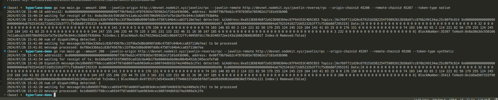

## Deprecated, See equivalent hyperlane-cross-rollup example instead

Please check hyperlane website on how to send hyperlane txs to any geth endpoint of the rollups provided in Nodekit.  We will wrap any hyperlane tx to a cross rollup bundle for you to pertain atomicity. 

Hyperlane website: https://docs.hyperlane.xyz/docs/guides/deploy-warp-route


---------------------

Currently we deployed HypNative contract on chain 45206 and HypERC20 contract on 45207, transfer between chain 45206 and 45207 are conversion from native token on chain 45206 to ERC20 token on remote. 

To bridge token from chain 45206 to 45207, the command is

```shell
go run main.go --amount 1000 --javelin-origin http://devnet.nodekit.xyz/javelin/rpc --javelin-remote http://devnet.nodekit.xyz/javelin-reverse/rpc --origin-chainid 45206 --remote-chainid 45207 --token-type native
```

To bridge tokens back, the command is 

```shell
go run main.go --amount 200 --javelin-origin http://devnet.nodekit.xyz/javelin-reverse/rpc --javelin-remote http://devnet.nodekit.xyz/javelin/rpc --origin-chainid 45207 --remote-chainid 45206 --token-type synthetic
```

One example: 

